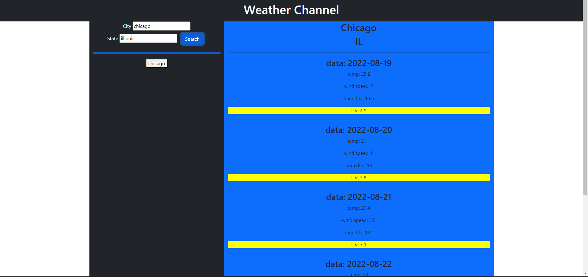
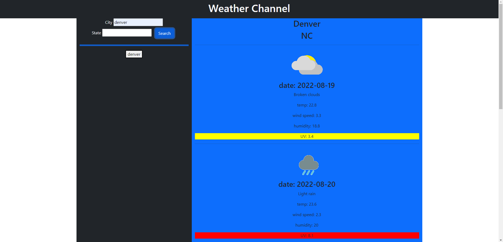

# weatherAPI

The goal of this module was to create a weather API website. 

The site is supposed to have a search function where you can type in a city and see the forecast for the next 5 days. This should dynamically create divs and display the date, the temperature, wind speed, humidity, and uv. For the UV display it should be color-coded depending on the level of UV rays.The search history of cities searched should also display somewhere and be saved to local storage.

